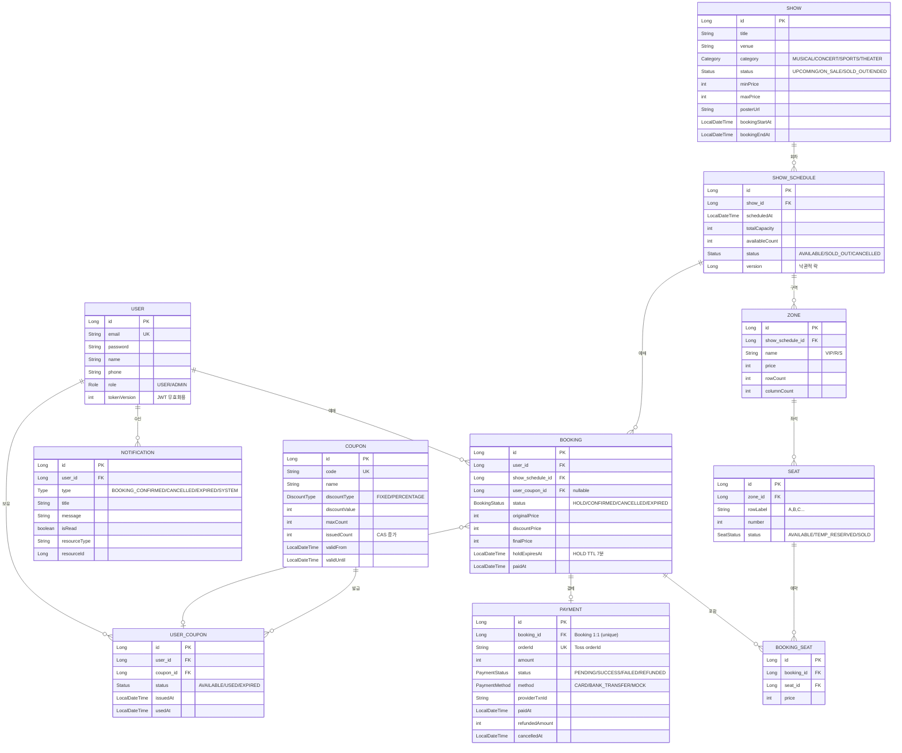

# goosebeoms-tickets

[](https://github.com/Young-BLUE/goosebeoms-api/actions/workflows/ci.yml)

공연 티켓 예매 백엔드 API

좌석 더블 부킹, 쿠폰 선착순, 대기열, 결제 정합성처럼 티켓팅 도메인에서 자주 마주치는 내용들을 다뤘습니다.

---

## 기술 스택

- Java 21, Spring Boot 4.0.1, Spring Security, Spring Data JPA
- DB: H2 (dev) / MySQL 8 (prod·test)
- Redis 7, Redisson 3.45 (분산락·대기열·Rate Limit)
- 토스페이먼츠 (test key) + Mock 게이트웨이 (전략 패턴)
- JJWT 0.12
- springdoc-openapi 2.7
- JUnit 5, Testcontainers (MySQL + Redis)
- Gradle

---

## 도메인 모델 (ERD)



동시성 제어 포인트:

- 좌석은 `SELECT FOR UPDATE` 비관적 락으로 multi-row 일관성을 보장하고, `SHOW_SCHEDULE.version` 낙관적 락으로 회차 잔여 좌석 집계 충돌을 막는 2계층 구조
- `COUPON.issuedCount` 는 CAS UPDATE (`WHERE issuedCount < maxCount`) 로 한도 초과를 차단. `user_coupons(user_id, coupon_id)` UNIQUE 제약으로 중복 발급 방어
- 예매 취소 시 쿠폰은 `USED → AVAILABLE` 복원. 단, 유효기간 지난 쿠폰은 복원하지 않음
- `USER.tokenVersion` 은 비밀번호 변경 / 로그아웃 시 증가시켜 기존 JWT를 무효화

---

## 실행

```bash
cd tickets

# Redis (선택, 없으면 분산락·대기열·Rate Limit 비활성)
docker run -d --name tickets-redis -p 6379:6379 redis:7-alpine

./gradlew bootRun
```

포트는 `8888`.

- Swagger: <http://localhost:8888/swagger-ui.html>
- H2 콘솔: <http://localhost:8888/h2-console> (JDBC `jdbc:h2:mem:ticketsdb;MODE=MySQL`, user `sa`)

### 더미 데이터

dev/prod 프로파일로 처음 띄우면 자동 시딩됩니다.

| 이메일 | 비밀번호 | 권한 |
| --- | --- | --- |
| `user@test.com` | `password123` | USER |
| `admin@test.com` | `password123` | ADMIN |

| 쿠폰 코드 | 내용 | 수량 |
| --- | --- | --- |
| `WELCOME10` | 10% 할인 | 100매 |
| `EARLY5000` | 5,000원 할인 | 50매 |
| `VIP20` | 20% 할인 | 10매 |

공연 25편 (회차 2개씩, 회차당 332석).

---

## 환경 변수

dev는 기본값으로 동작합니다. prod에서만 필수.

| 변수 | 설명 |
| --- | --- |
| `SPRING_PROFILES_ACTIVE` | `dev` / `prod` / `test` |
| `JWT_SECRET` | JWT 서명 키 (32바이트 이상) |
| `DB_URL` / `DB_USERNAME` / `DB_PASSWORD` | MySQL |
| `REDIS_HOST` / `REDIS_PORT` | 기본 `localhost:6379` |
| `CORS_ALLOWED_ORIGINS` | 콤마 구분, 기본 `http://localhost:5173` |
| `TOSS_CLIENT_KEY` / `TOSS_SECRET_KEY` | 토스 키 (dev는 공개 테스트 키 사용) |
| `PAYMENT_GATEWAY` | `mock` / `toss` |

대기열·토큰 만료 같은 세부 값은 `application.yaml` 의 `app.queue.*`, `jwt.*` 참고.

---

## API 요약

전체 명세는 Swagger 참고. 자주 쓰는 것만:

### 인증 `/auth`
| Method | Path | |
| --- | --- | --- |
| POST | `/signup` | 회원가입 |
| POST | `/login` | Access + Refresh |
| POST | `/refresh` | Access 재발급 |
| POST | `/logout` | Refresh 무효화 |
| GET | `/me` | 내 정보 |
| PATCH | `/me/password` | 비밀번호 변경 |

### 공연 (public)
| Method | Path | |
| --- | --- | --- |
| GET | `/shows?q=&category=&status=&minPrice=&maxPrice=&dateFrom=&dateTo=&sort=` | 검색 |
| GET | `/shows/{id}` | 상세 |
| GET | `/shows/{id}/schedules` | 회차 목록 |
| GET | `/schedules/{id}/seats` | 좌석 도면 |
| GET | `/schedules/{id}/seats/subscribe` | 좌석 SSE |

### 대기열 `/queue`
| Method | Path | |
| --- | --- | --- |
| POST | `/{scheduleId}/enter` | 진입 |
| GET | `/{scheduleId}/status` | 순번 확인 |
| GET | `/{scheduleId}/subscribe` | 진행률 SSE |

### 예매 `/bookings` (인증 필요)
| Method | Path | |
| --- | --- | --- |
| POST | `/hold` | 좌석 임시 점유 (대기열 통과 토큰 필요) |
| POST | `/{id}/payment/prepare` | 결제 준비 |
| POST | `/{id}/payment/confirm` | 승인 → 확정 |
| GET | `/me` | 내 예매 |
| DELETE | `/{id}` | 취소 (자동 환불) |

### 쿠폰 `/coupons`
| Method | Path | |
| --- | --- | --- |
| GET | `/` | 발급 가능 쿠폰 (public) |
| POST | `/{id}/issue` | 발급 (선착순) |
| GET | `/me` | 내 쿠폰함 |

### 관리자 `/admin/**` (`ROLE_ADMIN`)
공연/회차/쿠폰/예매 CRUD, 강제 취소, 사용자 검색, `/admin/stats` 통계.

---

## 테스트

```bash
cd tickets
./gradlew test
```

Testcontainers를 쓰므로 Docker가 떠 있어야 합니다. Docker가 없으면 통합 테스트는 자동으로 skip (`@Testcontainers(disabledWithoutDocker = true)`). MySQL 8 / Redis 7 컨테이너가 자동으로 뜨며, `withReuse(true)` 라 두 번째 실행부터는 빠릅니다. 재사용을 활성화하려면 `~/.testcontainers.properties` 에 `testcontainers.reuse.enable=true` 추가.

특정 테스트만:

```bash
./gradlew test --tests "*Concurrency*"
./gradlew test --tests "com.goosebeoms.tickets.domain.coupon.CouponConcurrencyTest"
```

주요 시나리오:

| 테스트 | 검증 |
| --- | --- |
| `CouponConcurrencyTest` | 1000명 동시 발급 → 한도만큼만 발급 |
| `BookingConcurrencyTest` | 같은 좌석 N명 동시 점유 → 1명만 성공 |
| `BookingRequiresQueueTokenTest` | 통과 토큰 없이 Hold 불가 |
| `BookingExpirationTest` | Hold 만료 시 좌석 자동 반환 |
| `CancelCouponRefundTest` | 취소 시 쿠폰 복원 (만료 쿠폰은 제외) |
| `CancelPaymentRefundTest` | 취소 시 Toss `/cancel` 호출 |
| `QueueEnter/Promotion/TokenExpiry` | 대기열 진입·순차 통과·TTL |
| `TossPaymentGatewayTest` | Toss 응답 파싱 |

`DataInitializer` 는 `@Profile("!test")` 라 테스트에선 더미 데이터가 안 들어가고, `TestDataFactory` 가 필요한 데이터를 직접 만듭니다.
